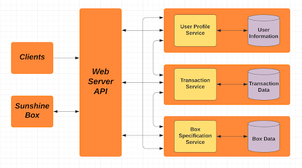
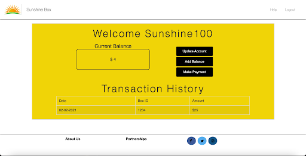
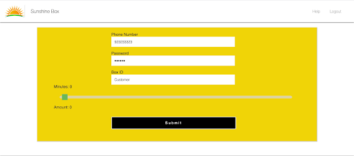
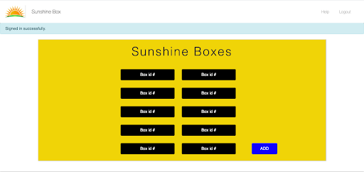
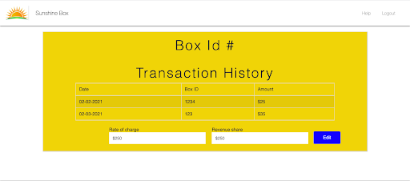

# CS6-Sunshine Box
 

# Problem Statement
Sunshine Box is a for profit company that provides developing countries with portable, solar-powered cell phone charging stations. Users pay agents who are owners of the box for charging time. The transactions that occur between a customer and a Sunshine Box are done completely through  text. A customer texts an agent the amount they would like to pay and the agent charges their cell phone for a certain amount of time. Our client tasked us with implementing  an application that makes it easier for her, agents, and customers to  manage, capture, and display data of the transactions between the box and customers in order to clearly show the income that each box is making. We were also tasked with implementing a way for Sunshine Box users to create an account (via text message/the web etc.) that allows them to deposit money and visualize records of their transaction history between Sunshine Boxes.

# Problem Context
Sunshine Box is determined in providing environmentally safe and affordable electricity to those in need of it. In countries such as Haiti, where laptops and computers are often impractical, a cell phone is usually the only way to do essential tasks like monitoring breaking weather conditions, staying informed on current events, conducting online banking or staying in touch with distant family. Currently 80% of Haitians have cell phones, but only 12% have access to electricity. Without a source of electricity, it becomes impossible to charge and use a cell phone, depriving a majority of citizens in Haiti the ability to access the internet and communicate via telecommerce. The Sunshine Box is a solution to this problem, as it serves as a lifeline to important functions, allowing the people who use it to stay connected. Since the Sunshine Box is solar powered it can be used at any time during the day and can be made available to anyone who wishes to use it. As of right now, all payments to the Sunshine Box are done upfront, which puts customers and agents at risk of being robbed. Implementing a web application which allows customers and agents to carry out these transactions will not only make it easier to use the Sunshine Box, but also safer.

# User Interface Requirements
The UI’s icons, tabs, and buttons should be self explanatory and should require no manual to read before operating. The UI should be minimalistic and include functions critical to the customer. The front end of the application will be developed using HTML and CSS. 

# Security Requirements
Our security requirements encompassed a comprehensive suite of measures, reflecting a commitment to safeguarding sensitive user data and fortifying system integrity. Among these, stringent protocols were established to ensure the  protection of customer accounts, mandating not only the implementation of secure passwords but also the fortification of Personal Identification Numbers (PINs) and cell phone numbers against unauthorized access or malicious exploitation.

# Documentation Requirements:
Our only documentation requirement was the implementation of a help button, which could be used in the event that a user is unable to decipher the UI. Unfortunately, we did not get around to implementing this.

# Performance Requirements
For our performance requirements we determined that the maximum load time of the app should be around two seconds and that there be a maximum of 10 menu options/button prompts per screen. We also required that the processing speed of the web application should not be affected by an increased number of boxes added to the fleet.

# Software Architecture

# Methodology
Agile: we used an agile methodology when implementing our web program, which allowed us to assess the requirements provided by customers of the Sunshine Box, to develop solutions through collaborative efforts between our development team and the end users. Further allowing us to adapt and update our software, by recognizing the ever-changing user stories and feedback we received. 

# Tool Selection
Ruby on Rails: or Rails, is a server-side web application framework written in the programming language Ruby. Rails is a model–view–controller framework, which provides default structures for a database, a web service, and web pages. By using Ruby on Rails, we were able to create a multifunctional web application that allowed multiple users to create accounts, and access features related directly to the Sunshine Box.

HTML/CSS: HTML is a Hyper Text Markup Language, which is the standard markup language used to create web pages. HTML is used to define the contents of web pages, and is often used hand in hand with CSS, Cascading Style Sheets. CSS is used to format the layout of a webpage, and saves a lot of time for programmers by allowing them to control the layout of multiple pages at once.

Javascript: javascript is used to program the behavior of the web page, and allows HTML pages to be more dynamic, fluid and interactive. It enhances the overall structure of web pages, and allows users to have a better experience using the web application.
Postgres: is a free and open-source relational database management system emphasizing extensibility and SQL compliance. The combined usage of the SQL language and many other features that Postgres provided, allowed us to safely store and scale the most complicated data workloads. 

# Project Management
Pivotal Tracker: this project management software allowed our team to assign tasks, and stay up to date on our most recent sprints. Although we found it difficult to use at first, it really helped us stay on track and get our tasks done diligently and in a timely manner.

# Source Code Management
Sublime: is a sophisticated text editor which is widely used among developers. It includes wide features such as Syntax Highlight, Auto Indentation, File Type Recognition, Sidebar, Macros, Plug-in and Packages that make it easy for working with code base. Due to previous experience with Sublime, and positive reviews from hundreds of other programmers, we decided to use this text editor for our web application.

# Build/Release Management 
Heroku: is a container-based cloud Platform as a Service (PaaS). Developers use Heroku to deploy, manage, and scale modern apps. Having used Heroku in the past, we decided that this platform was the most flexible, and easy to use, offering our team the simplest path to getting our web application deployed to the market.

# QA/Test Management
RSpec: this is a Ruby gem that can be installed and configured to allow us to run tests in our application. We frequently used RSpec to create and implement a test-driven approach to build out different features in our application. To run our tests, we frequently used the command ‘bundle exec rspec’ in our terminal which quickly allowed us to fix any issues without pushing our code and viewing it in our web browser. With these tests, RSpec quickly outputted the status of our tests, and whether or not they passed or failed - in which case we could leave our code as is, or implement changes until the test passed.

# Documentation Management
Github: is a code hosting platform for version control and collaboration. It allowed our team to work together on projects from anywhere. By editing our source code, we were easily able to push our code to our teammates, and pull their code in return. It proved to be the most functional way to complete a year-long project while not being in each other's presence due to the pandemic.

# User Interface
__Dashboard (Customer):__
<!-- Empty line -->
The customer dashboard has a number of modules. Current Balance displays the current balance in a customer’s account. Transaction History displays a record of the transaction history between a customer and a Sunshine Box.	
<!-- Empty line -->

-------------------

__Update Account Info (Customer):__
<!-- Empty line -->
In this module a customer can update his/her personal info Such as their phone number, password, and username
<!-- Empty line -->

-------------------

__Add Balance (Customer):__
<!-- Empty line -->
In this module a customer can add a balance to their account. Before a customer can add a balance they must input his/her phone number, password and the Box ID of the Sunshine Box they would like to use. Implemented a slider that calculates the rate of charge of the Sunshine Box.
<!-- Empty line -->

-------------------

__Dashboard (Admin):__
<!-- Empty line -->
The Administrator acts as the “mothership” and has control over all the Sunshine Boxes. The dashboard for the Admin profile can view all the Sunshine Boxes currently deployed.
<!-- Empty line -->

__Box Transaction History (Admin):__
<!-- Empty line -->
The Admin can view the details of the particular Sunshine Box. They can see info such as a box’s transaction history, rate of charge, and revenue share. The Admin can also edit the rate of charge and revenue share of each individual box.
<!-- Empty line -->

